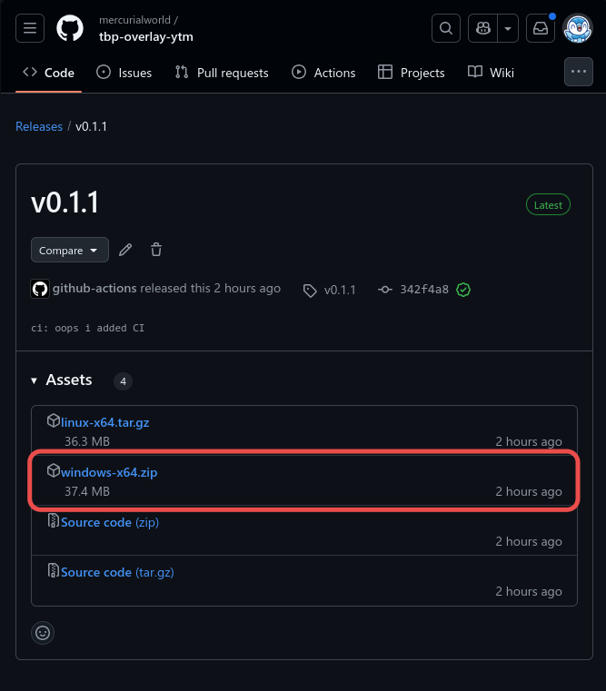
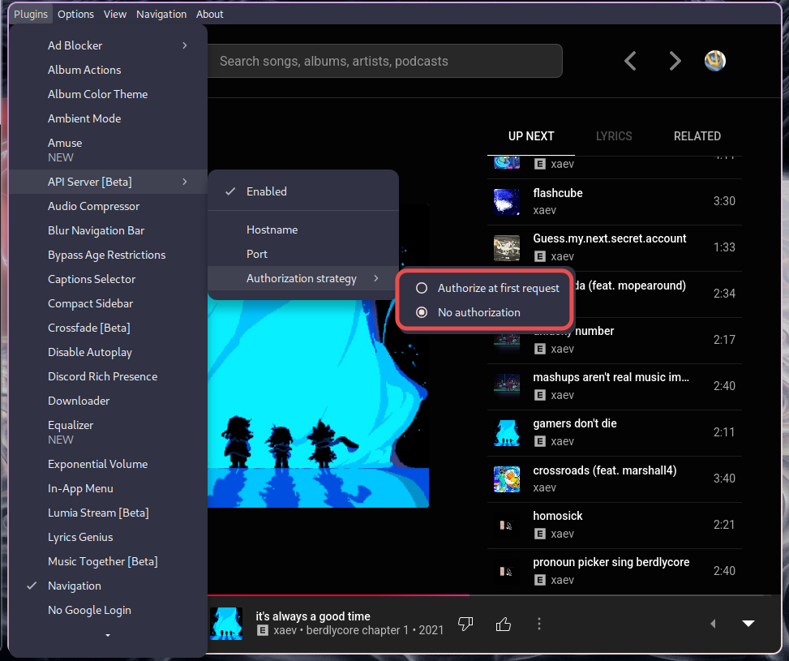

# Setup

## Download

In the [Releases page](https://github.com/mercurialworld/tbp-overlay-ytm/releases/latest), download the files for your operating system. (I'm assuming you're using Windows, so you'll want to download the `windows-x64.zip` file.)



Regardless of which operating system you're using, the contents of the compressed folder are as follows. Make sure you put these two files in their own folder when you extract them:

```
windows-x64.zip
├── config.json
└── tbpytmbridge.exe
```
## Config 

The `config.json` is formatted as follows:

```json
{
    "ytmURL": "http://127.0.0.1",
    "ytmPort": 26538,

    "parrotURL": "127.0.0.1",
    "parrotPort": 8989
}
```

`ytmURL` and `ytmPort` are the IP address/URL and port number of the YouTube Music client's API server\*. You shouldn't need to change this unless you change the settings in the YouTube Music client yourself.

If you are on Linux, **you must have a protocol in front of the URL/IP address (`http://`) for the `ytmURL` variable!** (I'm unsure if this is needed on Windows, but I'd assume so.)

`parrotURL` and `parrotPort` are for the websocket that Parrot's overlay will listen to. **This does not need a protocol, please do not add `http://` or `ws://` in front.**

\* From my experience (a Wayland compositor/window manager on Linux) I haven't been able to properly see this in the app itself, so I looked at the `config.json` for default values. These are more or less the defaults. I have no idea where this is located in Windows.

## YouTube Music



Make sure you enable the "API Server (Beta)" plugin. **Set the authorization strategy to "No authorization".** 

## Parrot's Stream Overlay


Under the "External Music Player" part of the **Connections** section, make sure to enable the **"Override music information with external player information"** setting. You can set the IP address/port to whatever you want, as long as you also change it in `config.json`.


Under the "Secondary Metadata" part of the **Now Playing > Metadata** section, **make sure to disable "Show release year after album information"**. If your playlist has a few videos from users, *you should probably disable "Show album metadata along with artist metadata"* as well.

## Running the program

All that's left is to double-click on the `tbpytmbridge` executable. A terminal should pop up. If there's something wrong, you'll have to close the terminal, edit the `config.json`, and relaunch the program -- "hot reloading" will probably come in a later release.

# Support

If you still need help, give me (`@mercurial_world`) a mention in the #other-support channel in Parrot's overlay support server, which you can find through [the overlays page](https://theblackparrot.me/overlays/).